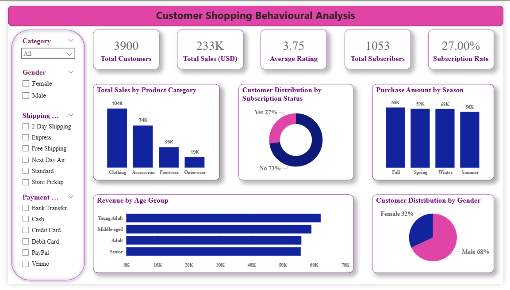

# 🛍️ Customer Shopping Behavior Analysis

---

# 📊 Project Overview

This project analyzes **customer shopping behavior** using retail transactional data to uncover insights into **spending patterns, product preferences, and customer segments**.

The goal is to generate **data-driven insights** that can help businesses improve **marketing strategies, customer engagement, and product positioning**.

The dataset contains **3,900 purchase transactions** across multiple product categories and customer demographics.

---

# 📂 Dataset Summary

| Attribute | Description |
|--------|-------------|
| Rows | 3,900 |
| Columns | 18 |
| Data Type | Transactional Retail Data |

### Key Features

👤 **Customer Demographics**
- Age
- Gender
- Location
- Subscription Status

🛒 **Purchase Details**
- Item Purchased
- Category
- Purchase Amount
- Season
- Size
- Color

📦 **Shopping Behavior**
- Discount Applied
- Previous Purchases
- Frequency of Purchases
- Review Rating
- Shipping Type

---

# 🧹 Data Cleaning & Feature Engineering

Performed using **Python (Pandas)**.

### Steps

✔️ Data Loading using Pandas  
✔️ Dataset Exploration using `df.info()` and `df.describe()`  
✔️ Missing Value Handling (Review Rating column)  
✔️ Column Standardization  
✔️ Feature Engineering  

### New Features Created

| Feature | Description |
|-------|-------------|
| age_group | Customer age segmentation |
| purchase_frequency_days | Purchase behavior indicator |

### Data Validation

- Verified relationship between **discount_applied** and **promo_code_used**
- Removed redundant columns

---

# 🧠 Business Analysis using SQL

Key business questions answered using **PostgreSQL**:

### Revenue Insights
- Revenue comparison by **gender**

### Customer Behavior
- High-spending customers using **discounts**

### Product Analysis
- **Top 5 products by review rating**

### Shipping Impact
- Comparison of **purchase amount by shipping type**

### Subscription Analysis
- Spending comparison between **subscribers vs non-subscribers**

### Discount Insights
- Products with **highest discount usage**

### Customer Segmentation

Customers segmented into:

- 🆕 New
- 🔁 Returning
- 💎 Loyal

### Product Popularity

- **Top 3 products per category**

### Demographic Insights

- Revenue contribution by **age group**

---

# 📊 Power BI Dashboard

An **interactive dashboard** was built to visualize key insights.

### Key Metrics

| Metric | Value |
|------|------|
| Total Customers | 3900 |
| Total Sales | 233K USD |
| Average Rating | 3.75 |
| Total Subscribers | 1053 |
| Subscription Rate | 27% |

### Dashboard Visualizations

📦 Total Sales by Category  
📬 Customer Distribution by Subscription Status  
🌤 Purchase Amount by Season  
👥 Customer Distribution by Gender  
💰 Revenue by Age Group  

---

# 📸 Dashboard Preview

  

---

# 🛠️ Tech Stack

| Tool | Purpose |
|----|------|
| 🐍 Python | Data Cleaning & Feature Engineering |
| 🐼 Pandas | Data Analysis |
| 🗄 MySQL | SQL Business Analysis |
| 📊 Power BI | Data Visualization |
| 📈 SQL | Querying & Insights |

---

# 🔍 Key Insights

📈 Certain product categories generate higher revenue.

💰 Customers using discounts sometimes spend **above average purchase amounts**.

📬 Repeat buyers are **more likely to subscribe**.

👥 Different age groups contribute differently to **total revenue**.

---

# 💡 Business Recommendations

✔️ Promote **subscription benefits** to increase recurring revenue  

✔️ Introduce **loyalty programs** for repeat buyers  

✔️ Optimize **discount strategies** to balance revenue and margins  

✔️ Highlight **top-rated products in marketing campaigns**  

✔️ Focus marketing on **high-revenue customer segments**

---

# 👨‍💻 Author

**Yash Shirsath**

🎓 AI & Data Science Student  
📊 Aspiring Data Analyst  

---

⭐ If you like this project, consider **starring the repository!**
